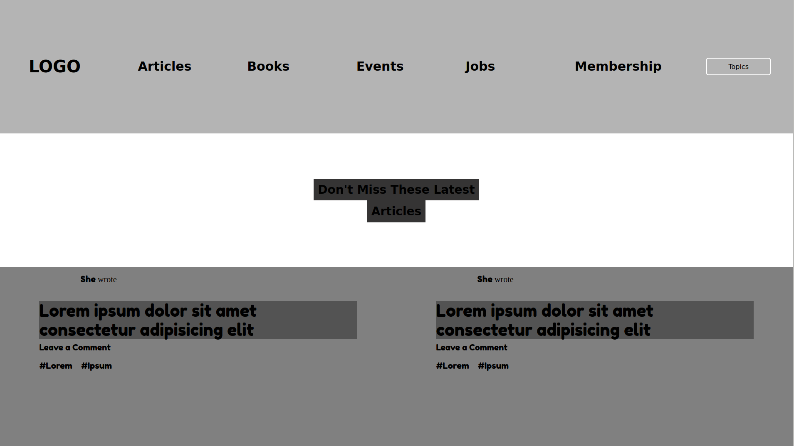

# Design Teardown

This is a visual hierarchy heat map of the webpage [Smashingmagazine.com](https://www.smashingmagazine.com/)

The goal for this exercise is to start training to think in terms of visual hierarchy, typography and design principles.

## Built With

- HTML,
- CSS

### Main Milestone

- To create a grayscale heat map of the website at [Smashingmagazine.com](https://www.smashingmagazine.com/) that indicates which elements have the greatest weight in the visual hierarchy.

## Live Webpage

[Click Here](https://raw.githack.com/SmithVyne/Design-Teardown/heat-map/index.html)

## Future Features:

- Implement responsive design.

## Authors

👤 **Smith Nkereuwem**

- Github: [@SmithVyne](https://github.com/smithvyne)

👤 **Miguel Tapia**

- Github: [@Meltrust](https://github.com/Meltrust)
- Contact me: original.mtapia@outlook.com

